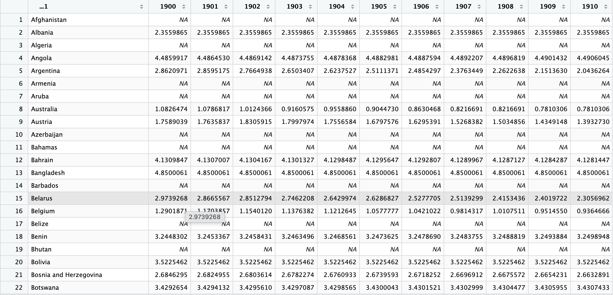

---
# The YAML header specifies several settings for the survey but is not required.
# A full list of settings can be found under _survey/settings.yml directory.

# Use this section to customize theme, progress bar, and footers
theme-settings:
  theme: default
  barposition: top
  footer-left: "Made with [surveydown](https://surveydown.org)"
  footer-right: '[<i class="bi bi-github"></i> Source Code](https://github.com/surveydown-dev/template_default)'

# Use this section to customize survey behavior and appearance
survey-settings:
  mode: preview
  show-previous: true
  use-cookies: false
  auto-scroll: false
  rate-survey: false
  system-language: en
  highlight-unanswered: true
  highlight-color: blue
  capture-metadata: true
  all-required: false
  all-shuffled: false
  required: 
    - consent1
    - consent2
    - first_name
    - last_name
    - comfort_data_science
    - comfort_data_skills
    - skills
    - topics
    - codeathon_R_skills
    - codeathon_skills_new_ways
    - codeathon_learned_more
    - ai_chatbot_in_codeathon
    - chatbot_supplemented_learning
    - stronger_skills_than_bot
    - deeper_understanding_than_bot

# Use this section to customize system messages
system-messages:
  warning: Warning
  previous: Previous
  next: Next
  exit: Finish
---

```{r}
library(surveydown)
```

--- welcome

# Data Science for Environmental Health (DaSEH) Post-Codeathon Course Survey

Thank you for taking the time to participate in this survey. We are collecting data about user experience with our course to learn more about how to improve the data science education experience. This data may ultimately be used for a research publication and reporting to the NIH.

**DATA CONFIDENTIALITY:** We will collect your name in order to track your progress through the course. We will also ask optional demographic information. The potential risks to you are small. The potential benefits to the community of data scientists, developers, and professors are very high – we will be able to learn how we can improve data science/environmental health education material.

**DATA SHARING:** We plan to release the data collected from this survey only in aggregate form using GitHub (<https://github.com/>). No personally identifiable information (such as your name or response timestamp) will be shared.

**PARTICIPATION:** You must be 18 or over to participate. You will be asked a series of questions about you, your institution type, your prior experience, and your expectations for the course. You can stop participating in the survey at any point. You do not need to answer optional questions. Only answers that are submitted by clicking the submit button at the end of the survey will be recorded. Depending on how you answer the survey, this will take ~10 minutes to complete. You will have an opportunity before submission to edit your responses. Any answers that are ultimately submitted (and not removed by the participant) will continue to be used for research.

General information about traffic to the case study websites and our main website (<https://daseh.org/>) is being tracked by Google Analytics (<https://analytics.google.com>). This provides us with summary information such as the number of visitors from different countries. We will not use this to try to identify who has submitted a survey response.

**RISK:** Risk of participation is minimal. The questions we ask pose minimal security risk to participants as they focus on your personal experience and expectations. Demographic questions are optional. While we have taken measures to ensure the security of the survey responses, please be aware that no online system is completely secure. By participating in this survey, you understand and accept the inherent risks associated with transmitting information over the internet.

**CONSENT:** The first questions will ask about your age and if you consent (or agree) that the data from your responses be used for research purposes.

**QUESTIONS OR PROBLEMS:** If you have questions or problems, email Ava Hoffman at <ahoffma2@fredhutch.org> or contact us through the anonymous [Code of Conduct Reporting Form](https://forms.gle/WBymAnzfWYpfWk4b6).

You may also contact the Fred Hutchinson Cancer Center IRB Office if you have questions about your rights as a participant. Contact the IRB if you feel you have not been treated fairly or if you have other concerns.

This study has been deemed exempt by the Fred Hutchinson Cancer Center IRB, specifically Exempt status (Category (2)(ii) Tests, surveys, interviews, or observation (low risk)). Thus, the proposed activity does not qualify as human subjects research as defined by DHHS regulations 45 CFR 46.102, and does not require IRB oversight.

IRB No.: FHIRB0020064  
Date Approved: 3/19/2024  

The IRB contact information is:
Address: Fred Hutch Cancer Center Institutional Review Office
1100 Fairview Ave. N. Mail Stop J2-100, Seattle, WA 98109
Telephone: 206-667-5900
E-mail: iro@fredhutch.org

```{r}
sd_question(
  type   = 'mc',
  id     = 'consent1',
  label  = "**Are you 18 or over?**\n\nYou cannot participate in this survey if you are under 18.",
  option = c('Yes' = 'yes', 'No' = 'no') # See app.R for conditional skip logic
)

sd_question(
  type   = "mc",
  id     = "consent2",
  label  = "**Do you consent to your responses being used for research purposes?**\n\nPlease see the description at the beginning of the survey for more information. Use the back button within this survey if you wish to see it again.",
  option = c("Yes" = "yes", "No" = "no") # See app.R for conditional skip logic
)
```

--- page2

# General Information

Here we are asking general information about you.

```{r}
sd_question(
  type  = "text",
  id    = "first_name",
  label = "**First or Given Name:**\n\n*This will only be used to match any of your survey responses through time.*"
)

sd_question(
  type  = "text",
  id    = "last_name",
  label = "**Last or Family Name:**\n\n*This will only be used to match any of your survey responses through time.*"
)
```

--- page3

# Post-Code-a-thon Knowledge

Here we are asking about your experience following the Code-a-thon.

```{r}
sd_question(
  type = "matrix",
  id = "comfort_data_science",
  label = "Now that you have participated in the Code-a-thon, how would you rate your current comfort with data science, generally?",
  row    = c(" " = "comfort_data_science_q"),
  option = c(
    "1 (Less comfortable)" = "1",
    "2" = "2",
    "3" = "3",
    "4" = "4", 
    "5 (More comfortable)" = "5"
  )
)

sd_question(
  type = "matrix",
  id = "comfort_data_tools",
  label = "Now that you have participated in the Code-a-thon, how confident are you in your ability to use data science tools (e.g., R programming, GitHub) to answer Environmental Health related questions?",
  row    = c(" " = "comfort_data_tools_q"),
  option = c(
    "1 (Less comfortable)" = "1",
    "2" = "2",
    "3" = "3",
    "4" = "4", 
    "5 (More comfortable)" = "5"
  )
)

sd_question(
  type = "matrix",
  id = "skills",
  label = "Please rate how you feel your skills have improved as a result of the Code-a-thon.",
  row    = c(" " = "skills_q"),
  option = c(
    "1 (Less comfortable)" = "1",
    "2" = "2",
    "3" = "3",
    "4" = "4", 
    "5 (More comfortable)" = "5"
  )
)

sd_question(
  type = "matrix",
  id = "topics",
  label = "Now that you have participated in the Code-a-thon, how would you rate your current confidence with these specific tools or topics?",
  row    = c("Rmarkdown / Reproducible documents" = "Rmd",
             "RStudio" = "RStudio",
             "Basic R Syntax" = "R_syntax",
             "Importing or loading data" = "data_import",
             "Subsetting datasets" = "subsetting",
             "Summarizing datasets" = "summarizing",
             "Data classes" = "data_classes",
             "Cleaning datasets" = "data_cleaning",
             "Reshaping or combining datasets" = "data_reshape",
             "Data visualization" = "data_viz",
             "Statistics / modeling" = "statistics", 
             "Functional programming" = "functional_programming",
             "GitHut / version control" = "github"),
  option = c(
    "1 (Less comfortable)" = "1",
    "2" = "2",
    "3" = "3",
    "4" = "4", 
    "5 (More comfortable)" = "5"
  )
)

sd_question(
  type = "matrix",
  id = "codeathon_R_skills",
  label = "The Code-a-thon helped me recall and apply my R skills",
  row    = c(" " = "codeathon_R_skills_q"),
  option = c(
    "Strongly Disagree" = "strong_disagree",
    "Disagree" = "disagree",
    "Neutral" = "neutral",
    "Agree" = "agree", 
    "Strongly Agree" = "strong_agree"
  )
)

sd_question(
  type = "matrix",
  id = "codeathon_skills_new_ways",
  label = "The Code-a-thon challenged me to use skills from the online course in new ways.",
  row    = c(" " = "codeathon_skills_new_ways_q"),
  option = c(
    "Strongly Disagree" = "strong_disagree",
    "Disagree" = "disagree",
    "Neutral" = "neutral",
    "Agree" = "agree", 
    "Strongly Agree" = "strong_agree"
  )
)

sd_question(
  type = "matrix",
  id = "codeathon_learned_more",
  label = "I learned more because of the Code-a-thon than I would have from the online course alone",
  row    = c(" " = "codeathon_learned_more_q"),
  option = c(
    "Strongly Disagree" = "strong_disagree",
    "Disagree" = "disagree",
    "Neutral" = "neutral",
    "Agree" = "agree", 
    "Strongly Agree" = "strong_agree"
  )
)
```

--- page4

# Data Skills

Here we will ask you some questions about data.

```{r}
sd_question(
  type   = "textarea",
  id     = "changes_to_viz",
  label  = "Now that you have participated in the Code-a-thon, what changes, if any, would you make to this dataset in order to do analysis or make a visualization?\n\nPlease provide a brief answer of 1-2 sentences."
)
```

```{r, fig.cap="Data to analyze"}

```

```{r}
sd_question(
  type   = "textarea",
  id     = "reproducibility_practices",
  label  = "Now that you have participated in the Code-a-thon, in your own words, describe practices you might use to make your work more transparent and reproducible in R.\n\nPlease provide a brief answer of 1-2 sentences."
)

sd_question(
  type   = "textarea",
  id     = "dataset_investigation_practices",
  label  = "Now that you have participated in the Code-a-thon, in your own words, describe a process you would typically take when investigating a new dataset.\n\nPlease provide a brief answer of 1-2 sentences."
)
```

--- ai

# AI and DaSEH

Your responses will be treated neutrally and will not affect future opportunities with DaSEH.

```{r}
sd_question(
  type = "matrix",
  id = "ai_chatbot_in_codeathon",
  label = "How much did you use AI chatbots (e.g., ChatGPT, Claude, CoPilot) during the Code-a-thon?",
  row    = c(" " = "ai_chatbot_in_codeathon_q"),
  option = c(
    "1 (Never)" = "1",
    "2" = "2",
    "3" = "3",
    "4" = "4", 
    "5 (Extensively)" = "5"
  )
)

sd_question(
  type = "matrix",
  id = "chatbot_supplemented_learning",
  label = "I found that AI chatbots supplemented my learning during the Code-a-thon.",
  row    = c(" " = "chatbot_supplemented_learning_q"),
  option = c(
    "Strongly Disagree" = "strong_disagree",
    "Disagree" = "disagree",
    "Neutral" = "neutral",
    "Agree" = "agree", 
    "Strongly Agree" = "strong_agree"
  )
)

sd_question(
  type = "matrix",
  id = "stronger_skills_than_bot",
  label = "I developed stronger skills through the Code-a-thon than I would have using AI chatbots alone.",
  row    = c(" " = "stronger_skills_than_bot_q"),
  option = c(
    "Strongly Disagree" = "strong_disagree",
    "Disagree" = "disagree",
    "Neutral" = "neutral",
    "Agree" = "agree", 
    "Strongly Agree" = "strong_agree"
  )
)

sd_question(
  type = "matrix",
  id = "deeper_understanding_than_bot",
  label = "I developed deeper understanding through the Code-a-thon than I would have using AI chatbots alone.",
  row    = c(" " = "deeper_understanding_than_bot_q"),
  option = c(
    "Strongly Disagree" = "strong_disagree",
    "Disagree" = "disagree",
    "Neutral" = "neutral",
    "Agree" = "agree", 
    "Strongly Agree" = "strong_agree"
  )
)

sd_question(
  type   = "textarea",
  id     = "ai_long_response",
  label  = "(OPTIONAL) Feel free to explain or describe any responses above."
)
```

--- open_feedback

# Open Feedback

Please provide your thoughts below.

```{r}
sd_question(
  type   = "textarea",
  id     = "suggestions",
  label  = "Please provide any suggestions regarding the Code-a-thon modality. This could be logistics, timing, projects, topics covered, standups, code review, lightning talks, etc."
)

sd_question(
  type   = "textarea",
  id     = "feedback",
  label  = "Please provide any feedback that you think could help us improve the DaSEH Code-a-thon. You can provide anonymous feedback
here: https://forms.gle/hQ7jdHZSZoDpHAdE6."
)
```

--- end

## Thank you for taking this survey!

```{r}
sd_close()
```

--- screenout

## Thank you for your interest!

Unfortunately, you do not meet the eligibility requirements for this survey.
